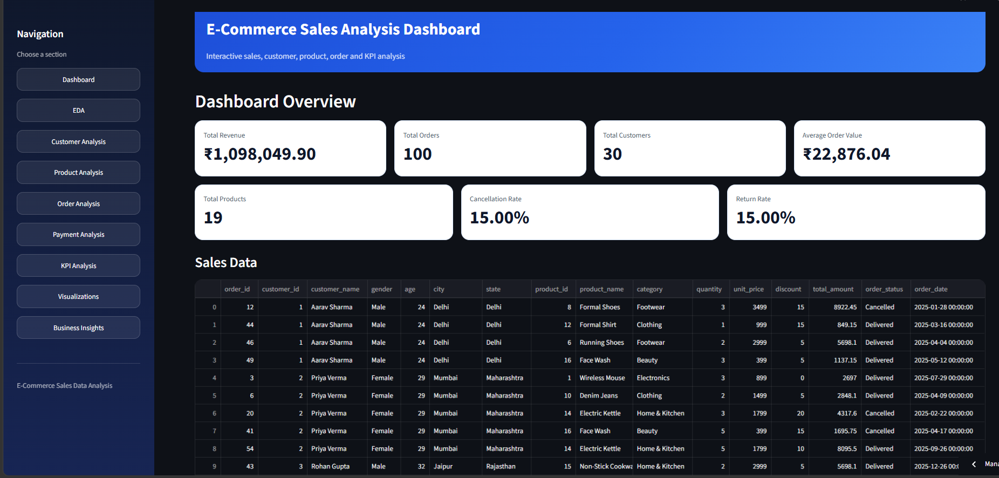
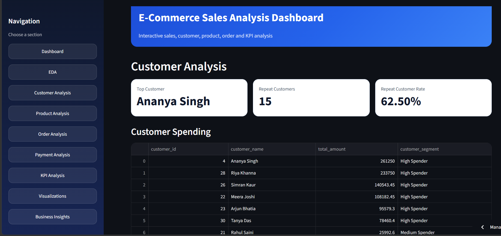
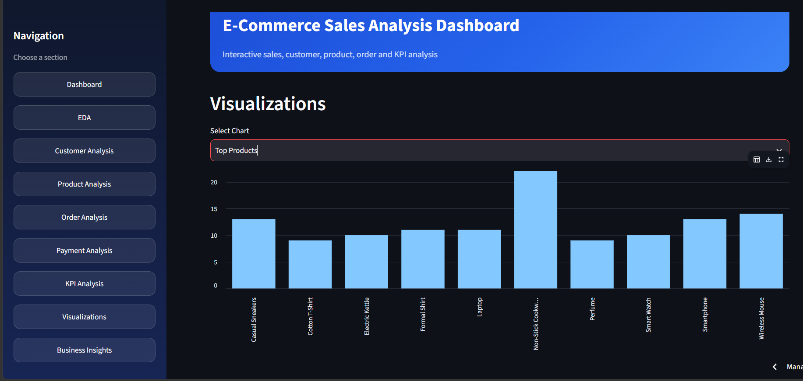
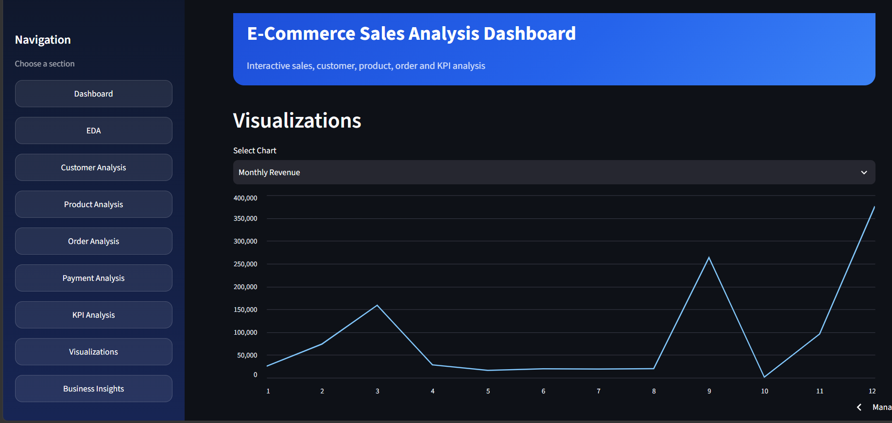
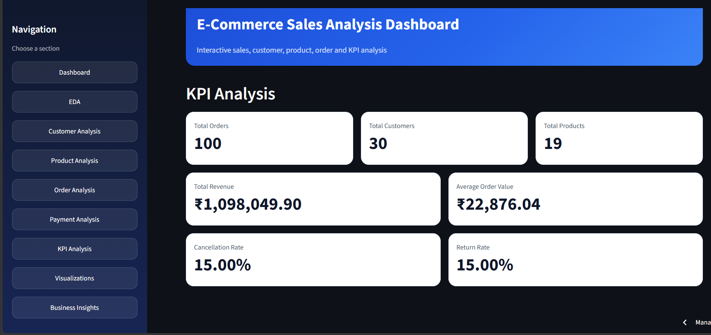

#  E-Commerce Sales Analysis Dashboard

##  Project Overview

The **E-Commerce Sales Analysis Dashboard** is an interactive data analytics project built using **Python, Pandas, NumPy, Matplotlib, and Streamlit**.

The project analyzes e-commerce sales data and provides insights into **sales performance, customers, products, orders, payments, KPIs, and business trends**.

The project was initially developed using a **MySQL database**. For deployment, the final Streamlit dashboard uses **CSV files**, making the application easier to deploy and access online.

---

##  Dashboard Preview

###  Dashboard Overview

The main dashboard displays important business KPIs such as Total Revenue, Total Orders, Total Customers, Average Order Value, Total Products, Cancellation Rate, and Return Rate.



###  Customer Analysis

Customer analysis identifies top customers, repeat customers, customer spending, customer segments, and demographic-based revenue performance.



###  Top Products Analysis

Product analysis helps identify the best-performing products based on sales quantity and revenue.



###  Monthly Revenue Trend

The monthly revenue visualization helps understand changes in sales performance across different months.



###  KPI Analysis

The KPI dashboard summarizes the most important business performance indicators.



---

##  Dashboard Features

- Interactive Streamlit Dashboard
- Exploratory Data Analysis (EDA)
- Customer Spending Analysis
- Customer Segmentation
- Repeat Customer Analysis
- Gender-wise Analysis
- Age Group Analysis
- State-wise Analysis
- Product & Category Analysis
- Order Status Analysis
- Discount Analysis
- Payment Method Analysis
- KPI Analysis
- Interactive Data Visualizations
- Business Insights

---

##  Key KPIs

| KPI | Value |
|---|---:|
| Total Orders | 100 |
| Total Customers | 30 |
| Total Products | 19 |
| Total Revenue | ₹1,098,049.90 |
| Average Order Value | ₹22,876.04 |
| Cancellation Rate | 15.00% |
| Return Rate | 15.00% |

---

##  Technologies Used

- **Python**
- **Pandas**
- **NumPy**
- **Matplotlib**
- **Streamlit**
- **CSV**
- **MySQL** — used during the original project development

---

## 📁 Project Structure

```text
E-Commerce-Sales-Analysis-Dashboard/
│
├── Sales_data_app.py
├── sales_data.csv
├── payments_summary.csv
│
├── data_cleaning.py
├── eda.py
├── numpy_analysis.py
├── customer_analysis.py
├── product_analysis.py
├── order_analysis.py
├── kpi_analysis.py
├── visualization.py
├── business_insights.py
│
├── requirements.txt
├── README.md
│
├── dashboard-overview.png
├── customer-analysis.png
├── top-products.png
├── monthly-revenue.png
└── kpi-analysis.png
```

---

##  Dashboard Sections

### 1. Dashboard

Provides a quick overview of important business metrics including:

- Total Revenue
- Total Orders
- Total Customers
- Total Products
- Average Order Value
- Cancellation Rate
- Return Rate

### 2. Exploratory Data Analysis

Provides:

- Dataset Shape
- Dataset Preview
- Statistical Summary
- Missing Values
- Order Status Distribution

### 3. Customer Analysis

Analyzes:

- Customer Spending
- Top Customer
- Customer Segmentation
- Repeat Customers
- Repeat Customer Rate
- Gender-wise Revenue
- Age Group Revenue
- State-wise Revenue

### 4. Product Analysis

Analyzes:

- Category Performance
- Top Category
- Top Selling Products
- Top Revenue Products
- Product Sales Quantity

### 5. Order Analysis

Analyzes:

- Order Status Revenue
- Average Discount
- Maximum Discount
- Minimum Discount
- Discount Performance

### 6. Payment Analysis

Analyzes payment method distribution using payment data stored in CSV format.

### 7. KPI Analysis

Displays important business performance indicators in an easy-to-understand dashboard format.

### 8. Visualizations

Interactive visualizations include:

- Monthly Revenue
- Category Revenue
- Category Quantity
- Top Products
- Top Customers
- Order Status
- Customer Segments
- Gender Revenue
- Gender Average Spending
- Age Revenue
- Age Average Spending
- State Revenue
- Discount vs Revenue

### 9. Business Insights

Summarizes the most important findings from the e-commerce sales data to support business decision-making.

---

##  Key Business Insights

- The dataset contains **100 total orders** from **30 customers**.
- Total delivered-order revenue is approximately **₹1.10 million**.
- Average Order Value is approximately **₹22.88K**.
- **15 customers** were identified as repeat customers.
- Repeat Customer Rate is **62.50%**.
- Cancellation Rate is **15%**.
- Return Rate is **15%**.
- Customer, product, category, state, and order-level analysis helps identify key sales performance patterns.

---

##  Data Files

The dashboard uses two CSV files:

```text
sales_data.csv
payments_summary.csv
```

`sales_data.csv` contains sales, customer, product, and order-related information.

`payments_summary.csv` contains payment method summary data.

---

##  How to Run the Project

### 1. Clone the Repository

```bash
git clone <https://github.com/Sakshi160244/E-Commerce-Sales-Analysis-Dashboard>
```

### 2. Open the Project Folder

```bash
cd E-Commerce-Sales-Analysis-Dashboard
```

### 3. Install Required Libraries

```bash
pip install -r requirements.txt
```

### 4. Run the Streamlit Dashboard

```bash
https://sales-dasboard-bysakshi.streamlit.app/
```

The dashboard will open in your browser.

---

##  Requirements

```text
streamlit
pandas
numpy
matplotlib
```

---

##  Project Objective

The main objective of this project is to transform raw e-commerce sales data into meaningful business insights and demonstrate practical skills in:

- Data Cleaning
- Exploratory Data Analysis
- Data Manipulation
- KPI Development
- Customer Analysis
- Product Analysis
- Business Analysis
- Data Visualization
- Interactive Dashboard Development

---

##  Author

**Sakshi Panchal**  
Aspiring Data Analyst
